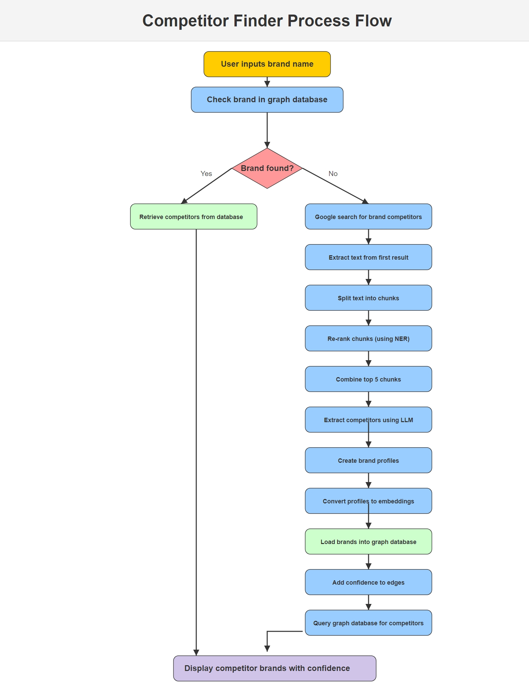

# Brand-Competitors : Gen AI solution to find global competitors for a brand 

Notebook link for testing - [Find brand competitors](url)

**Below are the detailed steps to be shown in the process flow**

1) User inputs the brand name
2) Check if the brand is present in graph database
	1) if brand is found, retrieve the competitors from the database
	2) if brand is not found, then run following steps - 
		1) google search for brand competitors
		2) extract all the text from the first link of google search results
		3) Split text into chunks of small sizes
		4) Re-rank the chunks based number of brand terms present (using NER)
		5) Combine the re-ranked first 5 chunks into single information chunk
		6) Extract the list of competitors from information chunk using an LLM
		7) Now, for each brand(target brand and the competitors), perform google search, get stats for the brand and create a crisp profile for the brand
		8) Convert each profile into embedding
		9) Load all of these brands into graph database as nodes(entities) are the brand names and the edges(relationship) between them is 'competitor'.
		10) Add confidence value to the edges i.e. cosine similarity between the embeddings between to brands
		11) Query the graph database to get the competitors for the original brand
3) With incremental searches the graph database gets enriched, leading faster retrieval for a given brand query

